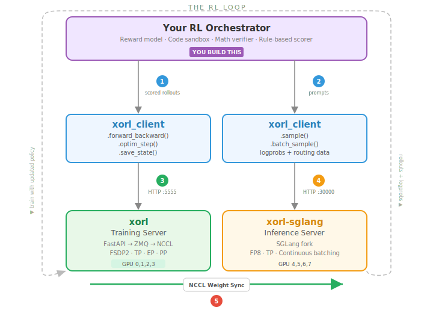

Server training exposes the training loop as a REST API, enabling external processes to drive gradient updates step by step. This is the primary mode for online RL training.

## How Online RL Works with XoRL

Online RL requires a **training server**, an **inference server**, and an **orchestrator** with a reward signal. XoRL provides the first three — you bring the reward.



**The RL loop:**

1. **Generate rollouts** — send prompts to xorl-sglang via `xorl_client.SamplingClient`. Returns completions + per-token logprobs.
2. **Score** — your reward model / verifier / environment scores the rollouts.
3. **Train** — pack scored rollouts into `Datum` objects, call `forward_backward()` + `optim_step()` on the xorl training server.
4. **Sync weights** — broadcast updated weights to xorl-sglang via NCCL. KV cache is flushed automatically.
5. **Repeat** with the updated policy.

| Component | Provided by | Description |
|---|---|---|
| Training server | **[xorl](/xorl/server-training/training-server/launching/)** | Forward/backward, optimizer, checkpointing, parallelism |
| Inference server | **[xorl-sglang](/xorl/server-training/sglang/)** | Rollout generation, per-token logprobs, weight sync |
| Client SDK | **[xorl-client](/xorl/server-training/client-sdk/overview/)** | Python SDK: `TrainingClient`, `SamplingClient`, `RestClient` |
| Reward / environment | **You** | Reward model, code sandbox, math verifier, rule-based scorer |

---

## Quick Start

**1. Start the training server:**

```bash
CUDA_VISIBLE_DEVICES=0,1,2,3 python -m xorl.server.launcher \
    --mode auto \
    --config examples/server/configs/full/qwen3_8b_full.yaml \
    --api-port 6000
```

**2. Start xorl-sglang inference:**

```bash
CUDA_VISIBLE_DEVICES=4 python -m sglang.launch_server \
    --model-path Qwen/Qwen3-8B-FP8 \
    --port 30000 \
    --tp-size 1 \
    --rl-on-policy-target xorl \
    --enable-fp32-router \
    --enable-fp32-lm-head
```

**3. Run training from Python:**

```python
import xorl_client

service = xorl_client.ServiceClient(base_url="http://localhost:6000")
client = service.create_training_client(base_model="Qwen/Qwen3-8B")

# Register inference endpoint for weight sync
import requests
requests.post("http://localhost:6000/add_inference_endpoint", json={
    "host": "localhost",
    "port": 30000,
    "worker_port": 30000,
    "world_size": 1,
})

# RL loop
for step in range(num_steps):
    # ... generate rollouts from sglang, compute rewards ...
    fwd = client.forward_backward(data, loss_fn="importance_sampling")
    opt = client.optim_step(xorl_client.AdamParams(learning_rate=1e-5))
    fwd.result(); opt.result()

    if step % sync_interval == 0:
        client.sync_inference_weights(
            master_address="localhost",
            master_port=29600,
        ).result()
```

For multi-node setup, server configuration, and launcher CLI options, see [Launching & Configuration](/xorl/server-training/training-server/launching/).

### Available configs

| Config | Model | Mode | GPUs |
|---|---|---|---|
| `full/qwen3_8b_full.yaml` | Qwen3-8B | Full-weight bf16 | 4 |
| `lora/qwen3_8b_lora.yaml` | Qwen3-8B | LoRA rank 32 | 4 |
| `qlora/qwen3_8b_qlora_nvfp4.yaml` | Qwen3-8B | QLoRA nvfp4 | 4 |
| `full/qwen3_coder_30b_a3b_full.yaml` | Qwen3-Coder-30B-A3B | Full bf16 (SP=4) | 8 |
| `qlora/qwen3_coder_30b_a3b_qlora.yaml` | Qwen3-Coder-30B-A3B | QLoRA (EP=4, SP=4) | 4 |
| `full/qwen3_235b_a22b_8node_ep64.yaml` | Qwen3-235B-A22B | Full bf16 (EP=64) | 64 |

### Matching inference models

| Training model | Inference model | TP |
|---|---|---|
| `Qwen/Qwen3-8B` | `Qwen/Qwen3-8B-FP8` | 1 |
| `Qwen/Qwen3-Coder-30B-A3B-Instruct` | `Qwen/Qwen3-Coder-30B-A3B-Instruct-FP8` | 2 |
| `Qwen/Qwen3-235B-A22B-Instruct-2507` | `Qwen/Qwen3-235B-A22B-Instruct-2507-FP8` | 4 |

---

## xorl-client

The [xorl-client](/xorl/server-training/client-sdk/overview/) Python SDK drives the training server — see the [Client SDK page](/xorl/server-training/client-sdk/overview/) for installation, client classes, loss functions, and training loop examples.

---

## Tinker API Compatibility

Tinker clients can create a usable session with `POST /api/v1/create_session`. The returned
`session_id` is registered as xorl's backing `model_id`, so follow-up requests may send either
`session_id` (Tinker-style) or `model_id` (xorl-native), and the server normalizes both forms.

| Endpoint | Description |
|---|---|
| `POST /api/v1/create_session` | Create/register a Tinker-compatible session ID |
| `POST /api/v1/session_heartbeat` | Refresh a session's idle timeout |
| `POST /api/v1/create_model` | Create/register a model session with explicit metadata |
| `POST /api/v1/unload_model` | Unload and release a session |
| `POST /api/v1/forward_backward` | Forward + backward pass |
| `POST /api/v1/optim_step` | Optimizer step |
| `POST /api/v1/weights_info` | Checkpoint metadata for model loading |
| `GET /api/v1/training_runs` | List training runs |

---

## Recommended Reading

XoRL's server training mode is designed for online RL with LLMs. The following papers provide background on the algorithms and system designs that XoRL supports:

### Foundational RL for LLMs

| Paper | Description |
|---|---|
| [Training language models to follow instructions with human feedback](https://arxiv.org/abs/2203.02155) (Ouyang et al., 2022) | InstructGPT — the original RLHF pipeline: SFT → reward model → PPO fine-tuning. Established the standard three-stage approach. |
| [DeepSeekMath: Pushing the Limits of Mathematical Reasoning](https://arxiv.org/abs/2402.03300) (Shao et al., 2024) | Introduces **GRPO** (Group Relative Policy Optimization) — a simpler alternative to PPO that uses group-level advantages without a value model. XoRL supports GRPO via `loss_fn="importance_sampling"`. |
| [DAPO: An Open-Source LLM Reinforcement Learning System](https://arxiv.org/abs/2503.14476) (Yu et al., 2025) | Decoupled clip ratios, dynamic sampling, token-level policy gradient, and overlong reward shaping. Demonstrates RL scaling without a value model. |
| [ReMax: A Simple, Effective, and Efficient Method for Aligning LLMs](https://arxiv.org/abs/2310.10505) (Li et al., 2023) | REINFORCE with a max-reward baseline — no critic needed. Shows that simpler RL methods can match PPO performance with less compute. |

### System Design: Pipelining and Async RL

| Paper | Description |
|---|---|
| [Asynchronous RLHF: Faster and More Efficient Off-Policy RL for Language Models](https://arxiv.org/abs/2410.18252) (Noukhovitch et al., 2024) | Decouples generation and training into async processes. Shows that off-policy RL (training on stale rollouts) works well with proper importance correction — the motivation behind XoRL's TIS (Temporal Importance Sampling). |
| [INTELLECT-2: A Reasoning Model Trained Through Globally-Distributed Reinforcement Learning](https://arxiv.org/abs/2505.07291) (Primeintellect, 2025) | Distributed async RL training across globally distributed nodes. Demonstrates that RL training can scale across unreliable, heterogeneous clusters. |
| [OpenRLHF: An Easy-to-use, Scalable and High-performance RLHF Framework](https://arxiv.org/abs/2405.11143) (Hu et al., 2024) | Ray-based RLHF framework with vLLM integration. Demonstrates the separation of training and inference into distinct processes — the same architecture XoRL uses. |
| [verl: Volcano Engine Reinforcement Learning for LLMs](https://arxiv.org/abs/2409.19256) (Sheng et al., 2024) | Hybrid pipeline that colocates actor and rollout on the same GPUs with memory sharing. Shows how to minimize GPU idle time in the RL loop. |

### Techniques Supported by XoRL

| Paper | XoRL feature |
|---|---|
| [GLM-5: Open Multilingual Multitask Model](https://arxiv.org/abs/2602.15763) (Team GLM, 2025) | **IcePop** — hard gradient masking for extreme importance ratios. Available via `icepop_beta` parameter in `policy_loss`. |
| [LoRA: Low-Rank Adaptation of LLMs](https://arxiv.org/abs/2106.09685) (Hu et al., 2021) | LoRA and multi-adapter support. XoRL supports multiple concurrent LoRA adapters switchable per request. |
| [QLoRA: Efficient Finetuning of Quantized LLMs](https://arxiv.org/abs/2305.14314) (Dettmers et al., 2023) | QLoRA training with nvfp4, block_fp8, and nf4 quantization formats. |

---

## Further Reading

| Topic | Page |
|---|---|
| Server architecture, multi-node, launcher CLI | [Launching & Configuration](/xorl/server-training/training-server/launching/) |
| REST API endpoints | [API Reference](/xorl/server-training/training-server/api-reference/) |
| xorl-sglang: weight sync, numerical alignment | [Inference: xorl-sglang](/xorl/server-training/sglang/) |
| Client SDK, loss functions, training patterns | [Client SDK (xorl-client)](/xorl/server-training/client-sdk/overview/) |
| NCCL weight sync protocol | [Weight Sync](/xorl/server-training/weight-sync/overview/) |
| SFT fine-tuning example | [SFT on No Robots](/xorl/server-training/examples/sft-no-robots/) |
| End-to-end weight sync test | [Password Memorization](/xorl/server-training/examples/password-memorization/) |
